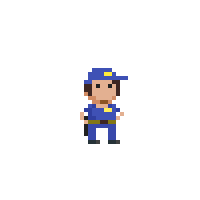

## For-loops

Een veelvoorkomende manier van while-loops gebruiken is waarbij je een bepaalde teller bijhoudt die je telkens met een bepaalde waarde verhoogt. Wanneer de teller een bepaalde waarde bereikt moet de loop afgesloten worden.

Bijvoorbeeld volgende code om alle even getallen van 0 tot 10 te tonen:

```csharp
int i = 0;
while(i<11)
{
    Console.WriteLine(i);
    i = i + 2;
}
```

**Met een for-loop kunnen we deze veel voorkomende code-constructie verkort schrijven.**

### For syntax

De syntax van een ``for``-loop is de volgende:
```csharp
for (setup; finish test; update)
{
    // C# die zal uitgevoerd worden zolang de finish test true geeft
}
```
* **setup**: In het setup gedeelte zetten we de "wachter-variabele" op de begin waarde. De wachter-variabele is de variabele die we tijdens de loop in het oog zullen houden en die zal bepalen hoe vaak de loop moet uitgevoerd worden (bv. ``int i = 0;``).
* **finish test**: Hier plaatsen we een booleaanse expressie die de wachter-variabele uit de setup gebruikt om te testen of de loop-code moet uitgevoerd worden (bv. ``i<11``).
* **update**: Hier plaatsen we wat er moet gebeuren telkens de loop z'n codeblock heeft uitgevoerd. Meestal zullen we hier de wachter-variabele verhogen of verlagen (bv. ``i = i + 2``).


 
Gebruiken we deze kennis nu, dan kunnen we de eerder vermelde code om de even getallen van 0 tot en met 10 tonen als volgt:

```csharp
for (int i = 0; i < 11; i += 2)
{
    Console.WriteLine(i);
}
```
Voor de setup-variabele kiest men meestal ``i``, maar dat is niet noodzakelijk. In de setup wordt dus een variabele op een start-waarde gezet. De finish test zal aan de start van iedere loop kijken of de finish test nog waar is, indien dat het geval is dan wordt een nieuwe loop gestart en wordt ``i`` met een bepaalde waarde, zoals in update aangegeven, verhoogd.



### for-tab-tab
Als je in Visual Studio ``for`` typt en dan tweemaal op [tab] duwt krijg je  kant en klare for-loop code.


### Break
Je kan loops (alle types) altijd vroegtijdig stopzetten door het ``break`` keyword. 


<!--- {height:50%} --->

Olla!? Wat denken we dat we aan het doen zijn? Gelieve dat keyword ogenblikkelijk terug uit je code te verwijderen. Bedankt. 

``break`` is de meer subtiele vriend van ``goto``. Hij leeft meer in de schemerzone tussen wat mag en niet mag. Dat maakt hem extra gevaarlijk. Voor je ``break`` als oplossing wilt gebruiken probeer je best eerst of je de loop niet mooier kan afsluiten door de juiste booleaanse expressie te beschrijven in de test-conditie.

Om iemand op StackOverflow te quoten: 
>When used at the start of a block, as first checks made, they act like preconditions, so it's good.
>When used in the middle of the block, with some code around, they act like hidden traps, so it's bad."

[Bron StackOverFlow: Are `break` and `continue` bad programming practices? ](https://softwareengineering.stackexchange.com/questions/58237/are-break-and-continue-bad-programming-practices)

Lees meer over het gebruik van ``break`` [hier](https://www.dotnetperls.com/break).




<!---NOBOOKSTART--->
## Kennisclip


* [De for loop](https://ap.cloud.panopto.eu/Panopto/Pages/Viewer.aspx?id=2df9d5bb-ecc8-489b-a1d4-a99800b79a5c)
<!---NOBOOKEND--->
