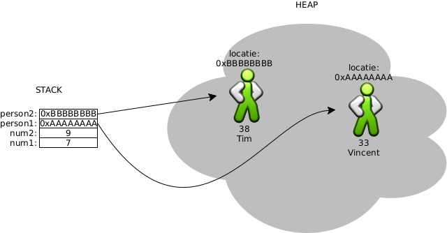
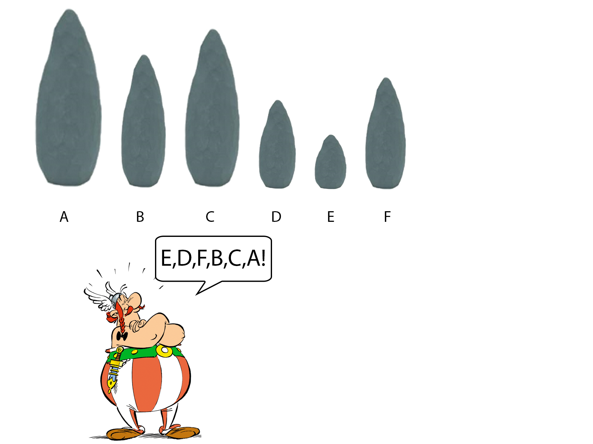

<style>
section {
  padding: 100px;
  padding-left: 120px;
  padding-bottom: 200px;
  background-image: url('background.png');
  background-size: cover;
}
h1 {
    color: rgb(153,35,36)
}
</style>

# OO Programmeren
<style scoped>
section {
  padding-left: 400px;
  color: white;
}
h1 {
  font-size: 60px;
  color: white;
}
a {
  color: white ;
}
h3 {
  font-size: 40px;
  color: white
}
</style>

### Geheugenmanagement

https://apwt.gitbook.io/cursus-pro-oo

---

# Objecten als argumenten

- Klassen zijn "gewoon" nieuwe types.
- Doorgeven als parameters in een methode.
- Verschil: **by reference**
    - Aanpassingen van object doorgegeven aan methode gebeuren ook op origineel object.

---

# Objecten als argumenten

```C#
class Meting
{
    public int Temperatuur { get; set; }
    public string OpgemetenDoor { get; set; }
}
```

---

# Objecten als argumenten

```c#
static void Main(string[] args)
{
    Meting m1 = new Meting();
    m1.Temperatuur = 26; 
    m1.OpgemetenDoor = "Elon Musk";
    Meting m2 = new Meting();
    m2.Temperatuur = 34; 
    m2.OpgemetenDoor = "Dennis Rodman";

    ToonMetingInKleur(m1, ConsoleColor.Red);
    ToonMetingInKleur(m2, ConsoleColor.Gray);
}

static void ToonMetingInKleur (Meting inmeting, ConsoleColor kleur)
{
    Console.ForegroundColor = kleur;
    Console.WriteLine($"Temperatuur {inmeting.Temperatuur}°C werd opgemeten door {inmeting.OpgemetenDoor}");
    Console.ResetColor();
}
```

---

# Objecten in methoden aanpassen

Objecten worden altijd **by reference** doorgegeven

```C#
static void ToonMetingEnVerhoog(Meting inmeting)
{
    ToonMetingInKleur(inmeting, ConsoleColor.Green);

    inmeting.Temperatuur++;
}
```
Als we deze methode als volgt aanroepen:
```C#
Meting m1 = new Meting();
m1.Temperatuur = 26; m1.OpgemetenDoor = "Elon Musk";

ToonMetingEnVerhoog(m1);

Console.WriteLine(m1.Temperatuur);
```
---

# Objecten in methoden aanpassen

Dit is niet zo bij primitieve datatypes zoals int.

```c#
static void VerhoogGetal(int inmeting)
{
    inmeting++;
}
``` 

Dit noemt men **by value**.

---

# Delen van objecten als parameter

```c#
static double Gemiddelde(double getal1, double getal2)
{
    return (getal1 + getal2) / 2;
}
```
Je mag deze methode dus ook oproepen als volgt:

```c#
double result= Gemiddelde(m1.Temperatuur, m2.Temperatuur);
```

---
# Objecten als resultaat

Ook klassen mogen het resultaat van een methoden zijn.

```c#
static Meting GenereerRandomMeting()
{
    Meting result = new Meting();
    Random r = new Random();
    result.Temperatuur = r.Next(-100, 200);
    result.OpgemetenDoor = "Onbekend";

    return result;
}
```

```c#
Meting m3 = GenereerRandomMeting();
```
---
# Objecten als resultaat

Een resultaat van een methode kan null zijn. Dus je kan het best nakijken vooraleer je er mee werkt:

```c#
Meting m3 = GenereerRandomMeting();
if(m3 != null)
{
    ToonMetingInKleur(m3, ConsoleColor.Red);
}
```

---
# Twee soorten geheugen

- Twee soorten geheugen toegewezen dat kan gebruikt worden:
    - Het kleine, maar snelle stack geheugen
    - Het grote, maar tragere heap geheugen

- Belangrijk om te weten wat waar wordt opgeslagen.
- Twee soorten variabelen:
    - **Value types**
    - **Reference types**

---
# Geheugenmanagement in C#

|  | Value types | Reference types |
| :--- | :--- | :--- |
| Inhoud van de variabele | De eigenlijke data | Een referentie naar de eigenlijke data |
| Locatie data | **Stack** | **Heap** \(globaal\)geheugen |
| Verwijzing? | / | Op de stack |
| Beginwaarde | `0`,`0.0`, `""`,`false`, etc. | `null` |
| Effect van = operator | Kopieert de actuele waarde | Kopieert het adres naar de actuele waarde |

---

```csharp
public static void Main() {
    int num1 = 7;
    int num2 = 9;
    Person person1 = new Person();
    Person.Age = 38;
    Person.Name = "Tim";
    Person person2 = new Person();
    Person.Age = 33;
    Person.Name = "Vincent";
}}
```


---

# Waarom twee geheugens?

- Bij compileren van applicatie: hoeveel geheugen nodig? 
- Bij uitvoeren weet OS hoeveel geheugen er gereserveerd moet worden.
- Niet alles kan perfect berekend/voorspeld worden.
    - Wel mogelijk bij een int.
    - Maar wat bij string? array? 
- Heap is minder gestructureerde manier om geheugen in te nemen.

---

# Value types

- De effectieve waarden van een value type worden in de stack bewaard. 
- De 'eenvoudige' of 'primitieve' datatypes inclusief enums en structs.
    - bv: int, long, char, float, boolean,...

---
# Assignment bij value types.

Wanneer we een value-type willen kopieren dan kopieren de echte waarde:

```c#
int getal=3;
int anderGetal= getal;
```

Aanpassing van deze variabelen heeft geen effect op de andere.

---

# Value types als parameter

```c#
void DoeIets(int a)
{
    a++;
    Console.WriteLine($"In methode {a}");
}

//Elders:
int getal= 5;
DoeIets(getal);
Console.WriteLine($"Na methode {getal}");
```
**Output:**
```
In methode 6
Na methode 5
```

---

# Reference types
- Effectieve waarde van een reference type wordt in de heap bewaard.
- Een referentie of pointer wordt in de heap bewaard.
- Een pointer is een geheugen adres naar waar verwezen wordt. (bv 0XA3B3163)
- Dingen die vaak groot kunnen zijn
    - Objecten, interfaces en delegates
    - Strings
    - Arrays

---

# Waarom references types? Menhirs!


- Munteenheid van het Eiland Yap zijn 4 meter hoge stenen. 
- Betalen? Met loodzware stenen sleuren?
- Sorteren? 
- "Die steen daar boven op de berg" is nu van u.
- Ze gebruiken "references" naar objecten die ze niet willen rondsleuren.

---

# Sorteren zonder references!


---

# Sorteren met references!



---
# Assignment bij reference types.

- Bij de = operator kopieren we de referentie naar de waarde.

---
# Wat doet new eigenlijk?

```c#
Student stud= new Student();
```

1. `new` roept de constructor van student aan. Er wordt geheugen vrijgemaakt in de heap en locatie wordt terug gegeven
2. Een variabele `stud` zal in de stack gemaakt worden.
3. De geheugenlocatie wordt in `stud` opgeslagen.
---

# Reference types met arrays

- Hetzelfde geldt voor arrays

```c#
int[] nummers= {4,5,10};
int[] andereNummers= nummers;
```

```c#
andereNummers[0]=999;
Console.WriteLine(andereNummers[0]);
Console.WriteLine(nummers[0]);
```

**Wat zal de output zijn?**

---

# References veranderen

```c#
Student a= new Student("Abba");
Student b= new Student("Queen");
a=b;
Console.WriteLine(a.Naam);
```

a en b zullen allebij naar dezelfde object in de heap verwijzen.

**Wat is de output?**

---

# Methoden en reference parameters

```c#
void DoeIets(int[] a)
{
   a[0]++;
   Console.WriteLine($"In methode {a[0]}");
}

//Elders:
int[] getallen= {5,3,2};
DoeIets(getallen);
Console.WriteLine($"Na methode {getallen[0]}");
```

**Wat is de output?**

---

```c#
void DoeIets(int a)
{
    a++;
    Console.WriteLine($"In methode {a}");
}

//Elders:
int[] getallen= {5,3,2};
DoeIets(getallen[0]); //<= VALUE TYPE!
Console.WriteLine($"Na methode {getallen[0]}");
```

**Wat is de output?**

---

# Garbage collector 
- Zorgt ervoor dat we geen geheugen voor niets gereserveerd houden
- Doorloopt geregeld het heap geheugen.
- Verwijdert data waar geen references meer naar zijn.

**bijvoorbeeld:**
```c#
int[] array1= {1,2,3};
int[] array2= {3,4,5};
array2=array1;
```
- Geen referentie meer naar `{3,4,5}`.
    - GC zal deze data verwijderen.

---

# Garbage collector

**Wil je niet dat de garbage collector data verwijdert?**
Maak een referentie op de stack naar dat geheugen.
```
int[] array1= {1,2,3};
int[] array2= {3,4,5};
int[] bewaarArray= array2;
array2=array;
```
(Dit is meer om de werking toe te lichten. Je hoeft het niet toe te passen.)

---

# NullReferenceException

```c#
Student stud1;
stud1.Naam= "Test";
```

- `stud1` bevat geen referentie naar een object in geheugen. 
- Bevat eigenlijk de waarde **null**.
- Als je de property Naam er op benadert:
    **- NullReferenceException!**
- Visual Studio zal dit zelfs niet toestaan

    ```c#
    Student stud1 = null;
    stud1.Naam= "Test";
    ```

---

# NullReferenceException

```c#
Student stud1 = null;

Console.WriteLine(stud1.Name);
```


---

# Hoe NullReferenceException voorkomen?

```c#
if(stud1 == null)
    Console.WriteLine("oei. object bestaat niet")
```

---
# Return null

- Methoden mogen null teruggeven.

    ```c#
    static Student ZoekStudent(Student[] array, string naam)
    {
        for (int i = 0; i < array.Length; i++)
        {
            if (array[i].Name == naam)
                return array[i];
        }

        return null;
    }
    ```
