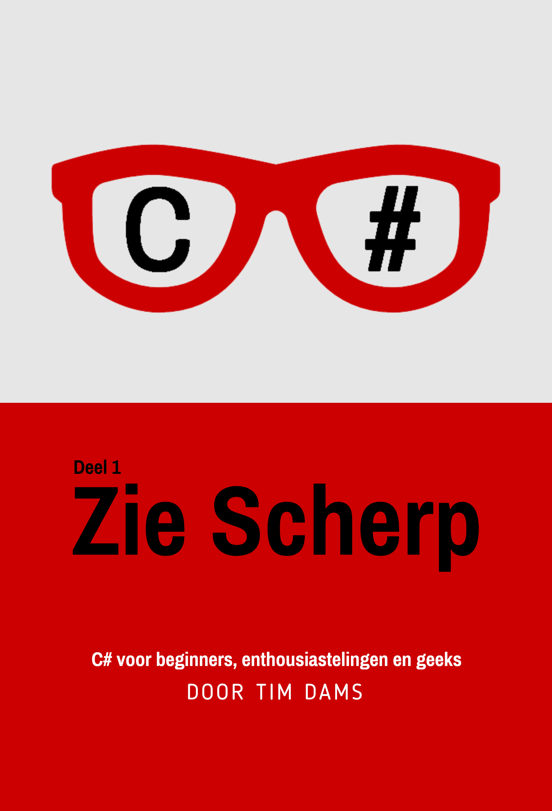

Deze cursus wordt ook aangeboden voor de "buitenwereld". Deze online cursus zal ten allen tijde gratis voor de studenten beschikbaar zijn. 

De gepubliceerde versies zijn identiek aan deze cursus.

Wil je toch een andere versie dan deze online versie dan kan dat via volgende kanalen:
* Amazon (soon) : fullcolor paperback versie, in groter formaat om aantekeningen bij de tekst te plaatsen
* Kobo (soon): ebook versie voor je e-reader
* [Leanpub](http://leanpub.com/ziescherp/): hoge-kwaliteits pdf (AP studenten kunnen deze gratis downloaden via digitap.ap.be)

