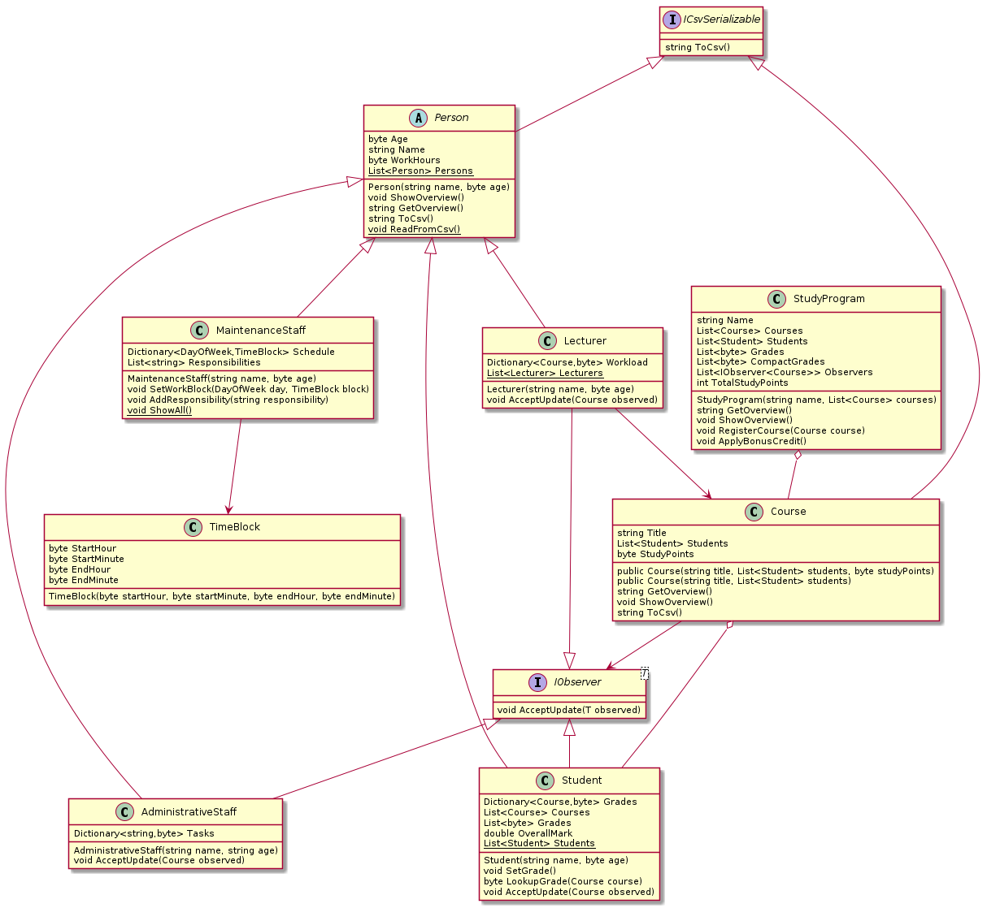
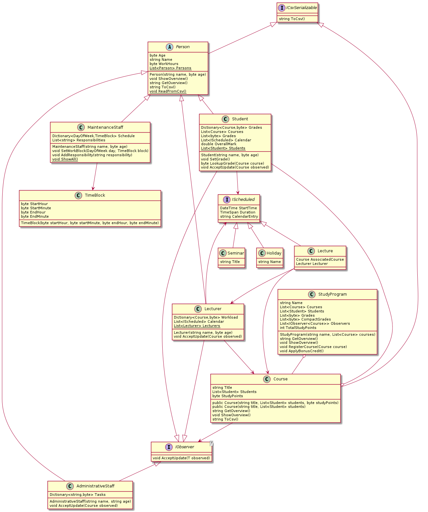

# Labo

## Implementatie `ICSVSerializable`

We vertrekken vanaf deze modeloplossing van het SchoolAdmin project. Hieronder vind je een overzicht van deze oplossing als UML-klassendiagram, een visuele notatie om aan te geven welke klassen met elkaar in verbinding staan en hoe:

`Program` staat hier niet op omdat we er geen objecten van aanmaken. De lijnen betekenen in het algemeen: "is gelinkt aan een of meerdere objecten van dit type", maar de pijlen met een witte driehoek \(hier bij `Person`\) wijzen op overerving. De rest van de notatie is nu niet erg belangrijk.

Wij zullen deze uitbreiden zodat ze overeenstemt met volgend diagram:


[Demonstratie toevoeging ICSVSerializable](https://www.youtube.com/watch?v=R11IYUce27Y)


## Implementatie `IObserver<T>`

Nog een typisch gebruik van interfaces is een soort "push notifications". Veel diensten kunnen berichten sturen naar je e-mail, je SMS, Discord, WhatsApp,... Deze diensten doen dit door een algemene interface te voorzien voor al deze communicatiekanalen en in andere code alleen te zeggen dat alle actieven kanalen aangesproken moeten worden.

Wij zullen dit als volgt implementeren \(bovenop de voorgaande uitbreiding\):

Hoe je dit doet, zie je hier:


[Kennisclip `IObserver<T>`](https://www.youtube.com/watch?v=INJ_H7AKCsE)\`\`


## Opdracht: implementatie `IScheduled` interface

Maak zelf volgende klassen, met de properties die op het diagram staan.

* `Lecture`
* `Seminar`
* `Holiday`

Je hoeft deze klassen niet in verder detail uit te werken \(constructor, exception handling enz.\).

Voeg vervolgens de interface `IScheduled` toe aan deze klassen. Deze interface staat ook op het diagram en bevat drie properties: een voor het starttijdstip, een voor de duur van dit geroosterde element en een voor de beschrijving die in de kalender moet verschijnen. Het is opnieuw genoeg dat deze interface geïmplementeerd is, het gaat niet om de uitwerking van de details.

Koppel nadat je deze interface geïmplementeerd hebt een `List<IScheduled>` aan de klassen `Lecturer` en `Student`. Voorzie een publieke getter voor deze lijst. Dit kan de basis vormen van een gepersonaliseerde agenda. Voeg gerust code toe aan `DemonstratePersons` om zeker te zijn dat je elementen van deze vier types in de lijst van een lecturer of van een student kan plaatsen.

## Opdracht: implementatie IComparer&lt;T&gt; interface

Een veelgebruikte interface in C\# is de `IComparer<T>` interface. Als je een object aanmaakt dat deze interface implementeert voor een specifiek soort `T`, kan je hem gebruiken om objecten van soort `T` te sorteren via `List<T>.Sort(IComparer<T>)`.

Deze interface bevat één methode, `Compare(T,T)`. Deze methode vergelijkt twee objecten van soort `T`. Als het eerste object voor het tweede object gesorteerd moet worden, geef je het resultaat -1 terug. Als het eerste object na het tweede object gesorteerd moet worden, geef je het resultaat 1 terug. En als beide objecten evenwaardig zijn voor de sortering, geef je 0 terug.

Je hoeft deze interface niet te schrijven, want hij is al voorzien. Je moet hem wel implementeren op volgende manieren:

* schrijf een klasse `StudentsByNameComparer` die `IComparer<Student>` implementeert
* schrijf een klasse `LecturersByAgeComparer` die `IComparer<Lecturer>` implementeert
* schrijf een klasse `CoursesByStudyPointsComparer` die `IComparer<StudyPoints>` implementeert

Test ten slotte de `LecturersByAgeComparer`: roep hiervoor `Lecturers.Lecturers.Sort(new LecturersByAgeComparer())` op nadat je lectoren hebt aangemaakt in `DemonstratePersons()` en laat dan je lectoren zien door de lijst te doorlopen en de elementen te printen. Als alles goed verlopen is, staan de lectoren van jong naar oud.

