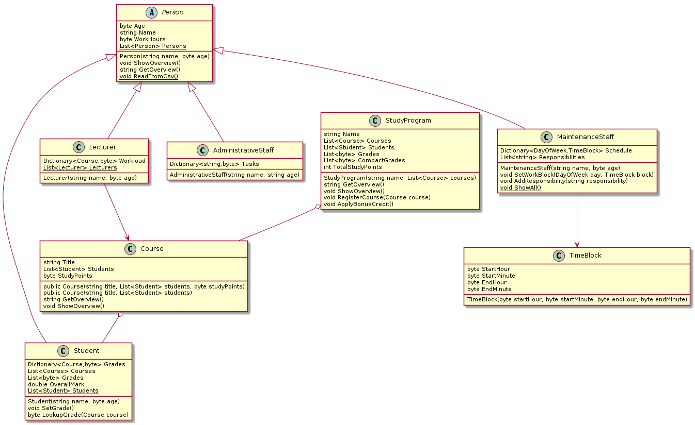

# Labo

## Uitbreiding cursussen met volgtijdelijkheden

We willen dat sommige cursussen enkel opgenomen kunnen worden als je een eerdere cursus hebt gevolgd. Daarom zullen we elke cursus voorzien van een volgtijdelijkheden, d.w.z. een lijst met andere cursussen die rechtstreeks vereiste voorkennis vormen voor deze cursus. We zullen dit voorstellen elke `Course` een property `Prerequisites` te geven. Hieronder volgt een filmpje dat dit helemaal demonstreert, maar lees eerst de opgave.

We starten vanaf code die hieronder gegeven wordt en die dit diagram implementeert:



We zullen dit aanpassen naar:


Nadat we deze aanpassing gedaan hebben, zullen we er voor zorgen dat we voor een gegeven cursus de lijst kunnen opbouwen die eerder gevolgd moeten zijn. We doen dit met een recursieve objectmethode `CollectAllPrerequisites(HashSet<Course> courses)`. Om dit te doen, passen we ook de `Equals` methode en de `GetHashcode` methode van `Course` aan.

De code om van te starten krijg je hier:



## Studieprogramma's met volgtijdelijkheden

Niet alleen cursussen hebben soms volgtijdelijkheden, het kan ook zijn dat je een studieprogramma moet hebben afgewerkt voor je aan een ander studieprogramma mag beginnen. Doe zelf de overeenkomstige aanpassing aan StudyProgram en implementeer `CollectAllPrerequisites(StudyProgram studyProgram, HashSet<StudyProgram>)`.

## Ruimtegebruik .cs files tellen

We willen nagaan hoe veel ruimte onze .cs files in een bepaalde directory en alle subdirectories hiervan in beslag nemen. Dit geeft ons een beeld van hoe groot onze code is.

Maak hiervoor in je algemeen oefeningenproject \(niet SchoolAdmin\) een klasse `Recursie`. Maak deze met een methode ShowSubmenu zoals [eerder](../h8-klassen-en-objecten/a_practica.md). Voeg een optie toe `H18-cs-bestanden`. Als de gebruiker deze optie kiest, wordt er een methode `TelCSBestanden` opgestart om de grootte van alle CS-bestanden \(genest\) in een bepaalde map op te tellen. Deze methode heeft return type `void`, vraagt om de map in kwestie, start de \(recursieve\) berekening en toont het resultaat, uitgedrukt in KB.

Om de recursieve berekening zelf uit te voeren, gebruik je een methode `TotalCSBytes(DirectoryInfo di)` met return type `long` . Deze geeft de totale omvang van alle CS-bestanden in de gevraagde directory terug als resultaat. De omvang in bytes van één bestand kan je verkrijgen via `FileInfo.Length`. Je kan omzetten van bytes naar kilobytes door te delen door 1024.

### Voorbeeldinteractie

```text
Welkom bij de demo Objectgeoriënteerd Programmeren!
Topic van de uit te voeren oefening?
1. DateTime
2. Properties en access modifiers
3. Recursie
> 3
Uit te voeren oefening?
1. H18-cs-bestanden
> 1
Wat is de rootmap van de .cs-bestanden?
> C:\Users\Vincent Nys\
Je hebt 25.42KB aan .cs-bestanden.
Topic van de uit te voeren oefening?
(...)
```

## Contact tracing

We zullen recursie gebruiken om na te gaan wie zich moet laten testen voor Covid19. Maak een klasse `Person` met twee properties: een naam en een `List<Person> Contacts`.  Twee personen zijn gelijk onder `Equals` als ze dezelfde naam hebben. De hash code van een persoon is de hash code van zijn/haar naam. Voeg aan je submenu een optie toe `H18-contacttracing`. Dit start een `void` methode `Person.SetupTracing()`.

`Person.SetupTracing()` vraagt eerst om namen van personen, totdat je een lege naam invoert. Daarna vraagt deze methode per persoon de contacten in te geven, gescheiden door komma's. Ten slotte vraagt de methode van welke persoon we de contacten moeten nagaan. Hier geef je één naam als antwoord en het aantal niveaus dat we teruggaan \(dus of we alleen rechtstreekse contacten opsporen of contacten van contacten of nog verder\).

Met deze informatie starten we een void objectmethode `Person.Trace(HashSet<Person> contacts, int level)` op. Deze methode voegt de contacten van de persoon in kwestie toe aan de set `contacts` and tracet dan hun contacten, tot het niveau `level` bereikt is. Dit kan je doen met een recursieve oproep van `Trace` die `level` met één verlaagt. Je kan voorkomen dat een persoon in zijn eigen contactenlijst staat door achteraf `HashSet<Person>.Remove(Person p)` te gebruiken.

### Voorbeeldinteractie

```text
Welkom bij contact tracing!
Geef de betrokken personen. Gebruik een witregel om te stoppen.
Dimitri
Annette
Dedue
Felix
Mercedes
Ingrid
Bernadetta
Edelgard

Geef de rechtstreekse contacten van Dimitri:
Dedue,Felix,Annette
Geef de rechtstreekse contacten van Annette:
Mercedes
... (hier overal geen contacten ingevuld)
Geef de rechtstreekse contacten van Mercedes:
Ingrid
... (hier overal geen contacten ingevuld)
Van wie wil je de contacten nagaan?
Dimitri
Hoe veel niveaus ver wil je zoeken? (1 = rechtstreekse contacten, 2 = contacten van contacten,...)
3
Dedue
Felix
Annette
Mercedes
Ingrid
```

